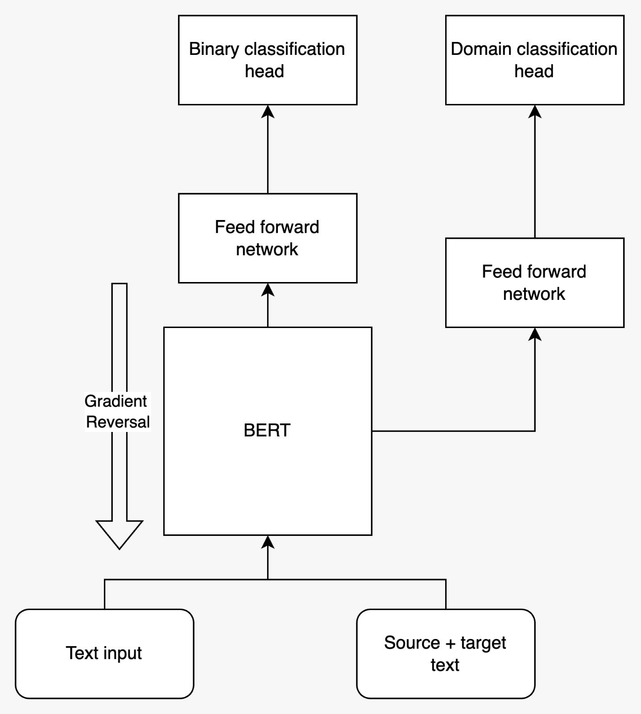

# Unsupervised-Domain-Adaptation-BERT-

Implementation of Unsupervised Domain Adpatation Using BERT via Gradient Reversal for Machine Generated Text Detection to Adapt to Different Topics.

### Architecture Diagram
>
